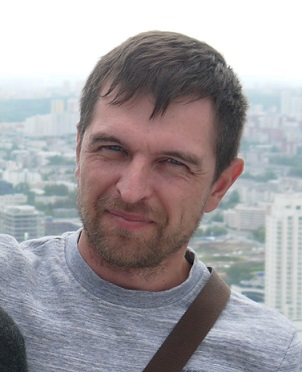

# Сергей Гребнев

**телефон:** +7 (913) 907-94-79

**email:** qa.serggrebnev@gmail.com

**Telegram:** [@CEPE7A_54](https://t.me/CEPE7A_54)

**GitHub:** [https://github.com/SergGrebnev](https://github.com/SergGrebnev)

# Инженер по тестированию

### Ключевые компетенции

- Знание методологий тестирования и техник тест-дизайна
- [Ручное тестирование](./img/certificate_01_manualWeb.pdf), написание тест-кейсов, баг-репортов
- Тестирование веб-приложений, REST API, понимание клиент-серверного взаимодействия
- Работа с DevTools, Postman (Bruno), Charles, Docker
- Понимание работы баз данных, написание SQL-запросов
- [Работа с Git](./img/certificate_02_Git.pdf)
- [Знание основ Java](./img/certificate_03_Java.pdf)
- [Знание основ Java Script](./img/certificate_05_JavaScript.pdf)
- [Автоматизированное тестирование на Java](./img/certificate_04_autoJava.pdf)
- [Автоматизированное тестирование web интерфейсов](./img/certificate_06_autoWeb.pdf)
- [Знание основ мобильного тестирования](./img/certificate_07_Mobile.pdf)
- [Знание основ тестирования производительности](./img/certificate_08_Load.pdf)
- Понимание HTML разметки
- Пользователь ОС Linux

### Профессиональный опыт
#### 03.2025 – настоящее время
- Инженер по тестированию в [Экосистеме Альфа](https://salfa.ru/). Проект: А-Маркет
    * Тестирование маркетплейса: web-приложение (фронт, бэк), android-приложение.
    * Создание тест-кейсов в системе управления Test IT.
#### 02.2005 – настоящее время
- Ведущий инженер средств радио и телевидения. РТРС - Российская телевизионная и радиовещательная сеть
    * Обслуживаю оборудование станций цифрового телевидения.
    * Провожу тестовые запуски нового оборудования.
    * Анализирую данные систем мониторинга (DatMiner, Zabbix, СДК), с целью диагностики отказов и неисправностей оборудования.
    * Документирую отказы в автоматизированной информационной системе (АИС РТРС)
    * Выполняю функции заместителя руководителя аварийно-профилактической группы.

### Образование
2001 - Новосибирский государственный технический университет (НГТУ), город Новосибирск,
специальность «Радиотехника», факультет Радиотехники, электроники и физики (РЭФ), степень - специалист, квалификация - инженер

### Курсы, тренинги:

#### 2025 -
Школа информационных и финансовых технологий (ШИФТ):
- курс QA Java [(сертификат)](./img/certificate_SIFT.pdf)

#### 2025 - 
Нетология - основной курс:
- направление «Программирование», курс «Инженер по тестированию: расширенный курс» [(программа курса)](https://netology.ru/programs/qa#/result_2)  

#### 2024 - 
Нетология - дополнительные курсы:
- HTML и CSS для тестировщиков
- [Основы разработки на Java](https://netology.ru/programs/java-free)
- Первые шаги в JavaScript
  

#### Изучил книги:
- Куликов С. - Тестирование ПО. Базовый курс.
- Назина О.Е. - Что такое тестирование. Курс молодого бойца.
- Сьерра К. - Изучаем Java
- Форта Б. - SQL за 10 минут

### Дополнительная информация:
Английский язык (А1 — Beginner)

Имею опыт программирования микроконтроллеров (С++), вёрстки сайта (HTML, CSS), администрирования локальной сети.

Занимаюсь разработкой и программированием устройств на основе Arduino.

### Обо мне
Решил продолжить развитие карьеры в сфере IT.

#### Наиболее привлекательным для себя считаю:
- автотестирование ПО,
- Web-тестирование и бэкенд,
- тестирование безопасности.
  
#### Основные критерии выбора компании: 
- стабильная компания,
- дружная команда,
- возможность удалённой работы,
- трудоустройство по ТК РФ.

